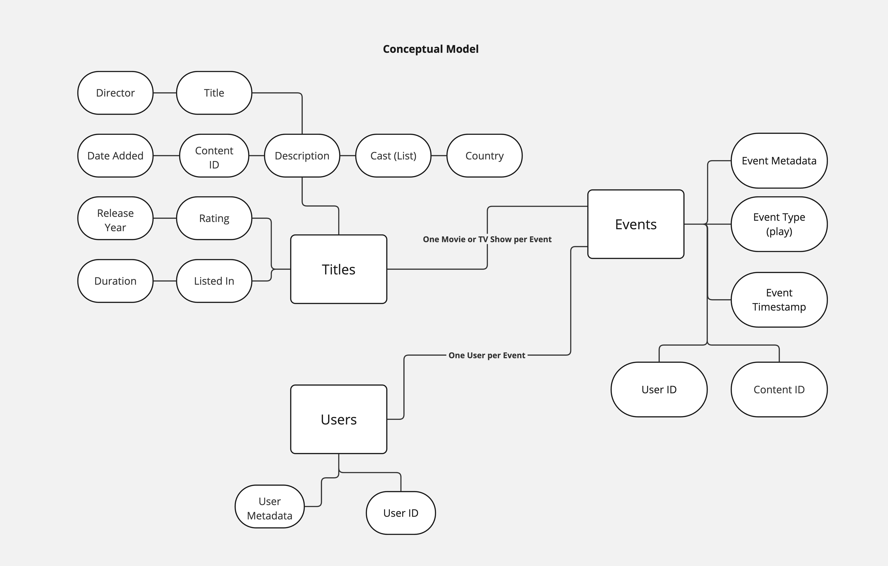

# netflix-data-pipeline-example

## Overview

This project is an attempt to recreate the Netflix Data Pipeline and Data Processing/Consumption platform described here:

https://www.youtube.com/watch?v=jMFMEk8jFu8

With the underlying infrastructure, I wanted to display my ability to work with the tools outlined in the Data Engineering job descriptions that can be found on the Netflix Careers page.

These skills inculde:
- Functional programming with Python
- Running Trino queries again Apache Iceberg backed tables
- Data modeling (star schema and aggregation tables via dbt)
- Executing a Flink job to process data moving between kafka topics

## Files and Folders

- `docker-compose.yml` - full stack needed for full pipeline and analysis stack
- `Dockerfile` - need custom image for PyFlink
- `trino_configs` - configurations mounted to Trino container
- `test_data` - folder mounted to Spark for upload to Iceberg Catalog and Backend
- `src` - source code by Python apps
- `netflix_dbt` - dbt project that will created star schema and aggregation tables.  I opted to use dbt as way to codify my understanding of the data modeling concepts.
- `pyproject.toml` and `poetry.lock` - Python project dependencies are managed by Poetry

## Running the Examples

Note: All commands are run from the root of the repository.

### Setup

You will need to install Poetry using the details described here:

https://python-poetry.org/docs/#installing-with-the-official-installer

Once Poetry is installed you can install the Python dependencies by running:

```
poetry install
```

You will Docker and Docker Compose available to run locally.  I use Docker for Mac that can be installed here: 

https://docs.docker.com/desktop/install/mac-install/

The environment can by deployed by running:

```
docker-compose up
```

### Loading Test Data into Iceberg

The goal of the data creation is to emulate a raw data footprint that consists of:

- Netflix Users - These are the subscribers.
- Netflix Titles - These are the TV shows and Movies.
- Netflix Play Events - This is a made up signal for when a subscriber watches a title.

Here is the conceptual model I originally created:



To load test data run the script:

```
./initialize_data.sh 
```

This will:

- Run `src/create_data.py` which will generate a fake set of 1000000 users.  The titles are provided in the repo at `test_data` downloaded from a Kaggle dataset.
- Run `src/load_data.py` on the running Spark cluster, which will load the users and titles csv files to Iceberg
- Run `src/event_creator.py` which will generate 100000 play events replicating 2 days worth of activity and send to a kafka topic.

This will results in 2 Iceberg tables:

- netflix.netflix.titles_raw
- netflix.netflix.users_raw

The kafka events will be incrementally inserted into a fact table during the data modeling phase.

### Data Modeling Phase

The goal here is create the following logical model: (Still working on this part)

Here are the steps for building out the initial data warehouse model.

(Still working on this part)

There are also sample SQL queries in the `netflix_dbt/samples.sql` file.  (Still working on this part)

### Running a Flink Job

(Still working on this part)